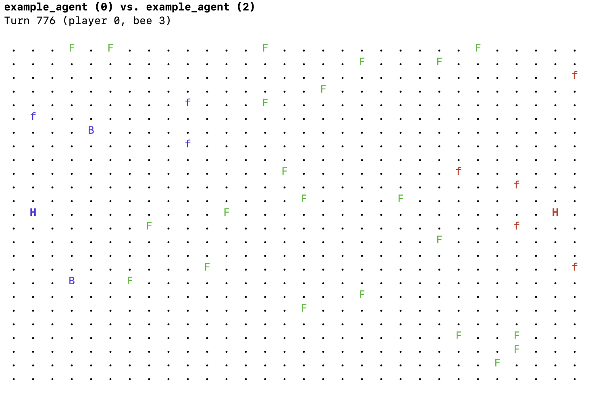

Hive Arena
==========

A friendly AI competition for the Hive students!

This repository contains all the technical elements of the Hive Arena competition:

- `src`: the source for the arena program and the libagent library. You won't need to modify this, but you are welcome to study it!
- `tools`: tools, currently only the viewer for the match logs.
- `example-agent*`: basic agents in various languages to help you get started.
- `docs`:
    - `rules.md`: the exact rules of the game, as they are implemented in the arena program
    - `howto.md`: how to build the arena and get started with your agent programming
    - `libagent.md`: details on the C library provided to build your agent
    - `protocol.md`: extra details necessary for those using other languages than C

Super quick start
-----------------

- Run `./match.sh example-agent example-agent`
- Toy with `example-agent/main.c`

All the rest is covered in the docs. Have fun! :)
